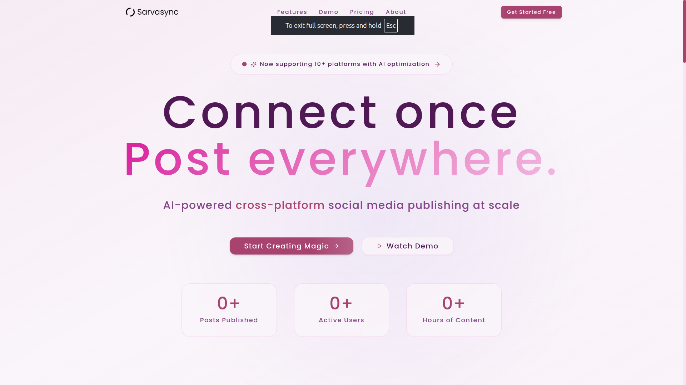

# SarvaSync - AI-Powered Social Media Management Platform

 <!-- Replace with actual hero image -->

**Revolutionize your social media workflow** with intelligent automation, cross-platform publishing, and data-driven optimization — all in one intuitive platform.

## 🚀 Key Features

- **AI Content Creator**: Generate high-performing posts with real-time optimization
- **Smart Post Adaptation**: Automatic reformatting for each platform
- **Multi-Platform Publishing**: Post to 10+ platforms simultaneously
- **Predictive Analytics**: Engagement forecasting and ROI tracking
- **Optimal Scheduling**: AI-calculated best times to post
- **Audience Targeting**: Precision tools based on demographics

## ✨ How It Works

1. **Write/Upload** your content
2. Let our **AI optimize** it for each platform
3. **Preview** platform-specific versions
4. **Publish everywhere** with one click

## 💎 Pricing Plans

| Feature               | Starter ($9) | Pro ($29) | Enterprise ($99) |
|-----------------------|--------------|-----------|------------------|
| Platforms             | 3            | Unlimited | Unlimited        |
| Posts                 | 10/month     | Unlimited | Unlimited        |
| Analytics             | Basic        | Advanced  | Advanced         |
| AI Optimization       | ❌           | ✅        | ✅               |
| Team Members          | 1            | 3         | Unlimited        |

**14-day free trial** • No credit card required

## 📥 Get Started

1. Sign up for a [free trial](#)
2. Connect your social platforms
3. Start creating AI-optimized content

---

✨ **Start creating magic with your social media today!** ✨